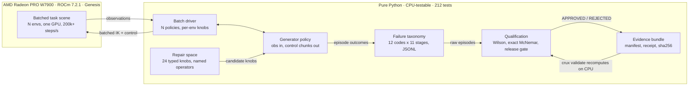

# CRUX

**Failure-discovery → repair → qualification for contact-rich robot manipulation,
end to end on one AMD Radeon GPU.**

Track 3 · Physical AI · AMD AI DevMaster Hackathon 2026 · [Evidence page](https://enoch208.github.io/Crux/) · [Demo video](evidence-dev/render/crux-demo.mp4) · [Technical report](docs/technical-report.md) · [Gate-by-gate evidence](docs/acceptance-gates.md) · [Poster](docs/poster.pdf)

A Franka arm routes an articulated cable through clip gates and seats its connector,
simulated in Genesis on a Radeon PRO W7900 (ROCm 7.2.1, `gs.amdgpu`). CRUX finds how
the controller fails, isolates each mechanism with matched batched experiments, repairs
what it can, qualifies the result on held-out conditions — and packages every number so
you can verify it yourself.

## The 60-second version

1. **The result.** A repair chain selected by the discovery loop raises seating-stage
   arrival from **0/32 to 12/32 (+37.5 pp, exact McNemar p = 0.0005)** on virgin
   held-out seeds — and the *identical* +37.5 pp at the identical p = 0.0005 on a
   second independent suite. The discovery campaign also exposed that the original
   success metric was **geometrically unsatisfiable** (five falsified repair families
   converged on the proof); after the correction, the first completed episodes ever
   appeared — 3 of them, honestly reported as statistically indistinguishable from
   zero. One significant-looking claim failed to replicate and is withdrawn in
   writing.
2. **The scale.** ~**200k–293k environment-steps/s** on one Radeon at 4,096 batched
   environments (two runs reported, spread disclosed). The 64-episode qualification
   took 93 seconds; the discovery campaign ran 32 simultaneous episodes every ~4 min.
3. **The rigor.** Reset is bit-exact but contact rollouts are not reproducible on this
   stack (measured, and an earlier PASSED claim retracted because of it); the release
   gate rejected our first two candidates and issued its **first APPROVED** only after
   the metric correction, on a real primary-endpoint improvement with zero regression;
   every failed episode is retained; the evidence bundle is hash-verified and
   recomputes its own headline numbers.

## Verify it yourself (CPU only, no GPU required)

```bash
uv sync
uv run pytest -q                                  # 212 tests, ~1 s
uv run crux validate evidence/manifest.json       # hash + recompute the evidence bundle
uv run crux report evidence-dev/qualification_v3_standard_fixedmetric.jsonl \
  evidence-dev/qualification_v3_fixedmetric.jsonl \
  --baseline-version baseline-v1 --repaired-version candidate-v3 \
  --config configs/qualification.yaml             # every headline number from raw JSONL
```

Tamper with one byte of an episode file and `crux validate` fails. That is the point.

## Architecture



Physics, IO and GPU sit behind thin adapters; policy logic, qualification math and
evidence checks are pure and unit-tested on CPU. The GPU is only ever asked to step
physics.

## What's here

| Path | What it is |
|---|---|
| `src/crux/control/` | Generator policy + batch driver — the controller, CPU-testable |
| `src/crux/failures/` | 12-code failure taxonomy, episode records, JSONL recorder |
| `src/crux/repair/` | Typed knob space, named repair operators, composing search |
| `src/crux/qualification/` | Wilson/McNemar, matched pairing, release gate |
| `src/crux/evidence/` | Bundle builder + CPU validator (manifest, receipt, hashes) |
| `src/crux/simulation/` | Genesis adapters + every gate/sweep experiment, in order |
| `upstream/` | Minimal reproductions for three Genesis findings |
| `docs/` | Technical report, acceptance gates with raw evidence |
| `configs/` | Every constant in the system |

## The discovery campaign in one table

Sixteen matched sweep rounds plus an instrumented post-mortem, ~900 batched episodes,
eight mechanisms — each isolated by an experiment that falsified the alternatives
(full detail in the report):

| Mechanism | Fix |
|---|---|
| Routing slip is force-invariant (−28…−72 N) | — |
| …and speed-invariant (0.06–0.60 m/s) | — |
| Diagonal transport wedges the strand at the gate | Lift-then-translate |
| Release recoil throws a dangling connector 50–80 mm | Grip the connector link |
| The pinch slides axially while corrections read converged | −56 N clamp → sub-mm alignment |
| The open gripper cannot pass the channel walls (stalls at −22 mm at every force) | Mouth entry + fingertip nudge; residual is geometric — documented, not hidden |
| Single-shot regrips close on air (18/32 post-mortem episodes, gap 0.3–3.3 mm) | Re-observed grasp retries (×3) — MISSED_GRASP 19 → 6 on virgin seeds |
| Five seating methods all stall at the same 12–13.4 mm floor | The floor *was* the fully-seated position: the success metric measured the connector's trailing joint, making success geometrically impossible — metric corrected, impossibility proof pinned as a CPU test, everything re-qualified |

## Built for any controller — including learned ones

The policy interface is a generator: observations in, control chunks out — the same
shape as a VLA or RL policy's action loop. Everything downstream (taxonomy, matched
suites, McNemar qualification, release gate, hash-verified evidence) never asks how
the actions were computed. The scripted controller here is the *first* policy the
harness qualified — chosen so every number is attributable to the harness, not a
model. The question CRUX answers is the one the field can't currently answer at all:
*is the new checkpoint actually better, and can you prove it to someone who wasn't
there?*

## Honesty rules this repo lives by

Every displayed number is computed from machine-readable evidence. Failed episodes are
never deleted. Baselines are frozen before comparison; held-out seeds never touch
selection. Claims that turned out to be over-stated (episode reproducibility) were
retracted in writing. The cable is an articulated chain, not a deformable — and no
sim-to-real claim appears anywhere in this repository.
