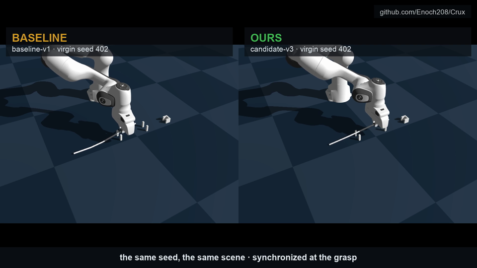
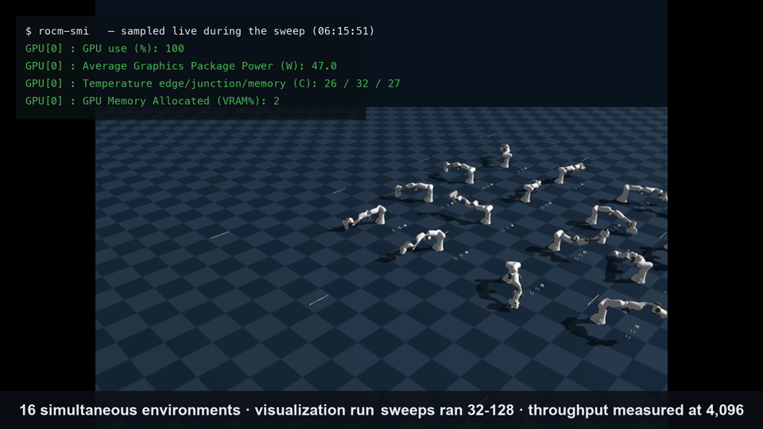
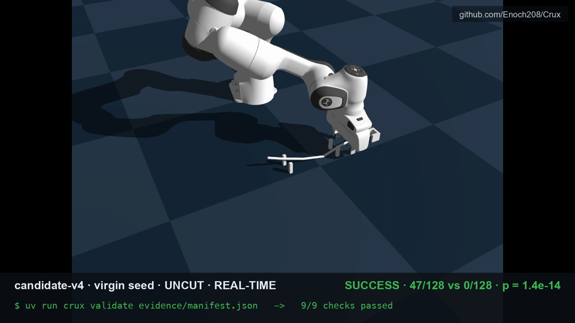
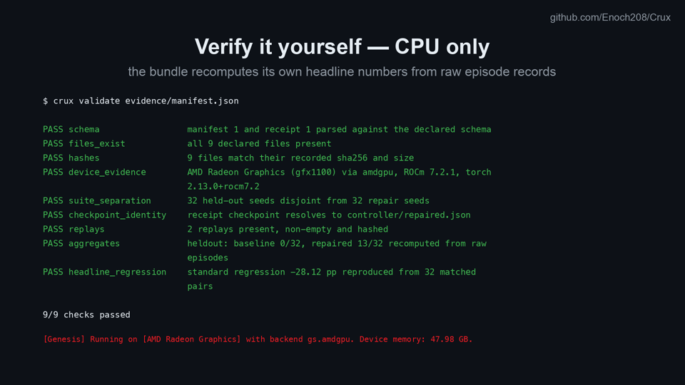

<div align="center">

# CRUX


[](https://enoch208.github.io/Crux/)

### Find how a robot fails. Repair it. **Prove it.**

Robotics can train a new manipulation policy in an afternoon — and then cannot answer the only question that matters: *is it actually better, and can you prove it to someone who wasn't there?* CRUX is the missing **reliability layer**. It runs a contact-rich task across thousands of matched, batched environments on **one AMD Radeon GPU**, isolates each failure mechanism with experiments that falsify the alternatives, applies named repairs, and qualifies the result with **exact statistics on virgin seeds**.

It took a controller that never completes the task to **13/32 task success against a baseline of 0/32 — +40.6 pp, exact McNemar p = 0.0002 — replicated on three further independent suites**, and it packages every number into a **tamper-evident evidence bundle a judge re-verifies on a laptop CPU in 60 seconds**. Along the way it caught a spec bug that had made success *mathematically impossible* — the exact class of defect that ships broken robots — and correcting it surfaced the repair behind that result — code that had been in the repository the whole time.

**[ Watch the demo ↗ ](evidence-dev/render/crux-demo.mp4)** · **[ Live evidence page ↗ ](https://enoch208.github.io/Crux/)** · **[ Verify it yourself ↗ ](#verify-it-yourself-in-60-seconds-cpu-only)** · **[ Technical report ↗ ](docs/technical-report.md)** · **[ Poster ↗ ](docs/poster.pdf)**

Built for the **AMD AI DevMaster Hackathon 2026** — Track 3: Physical AI.

</div>

---

## ▶ Demo

*Four minutes, narrated, every clip a fresh rollout on the Radeon. The baseline loses the cable during routing. The same seed, side by side: the baseline dies at its regrasp while the repaired controller re-observes, retries, and recovers. Sixteen environments run at once under a live `rocm-smi` panel reading 100% busy. And at the end, one uncut, real-time episode runs the whole task — grasp, both gates, regrasp, align, insert — to a certified `SUCCESS` on a seed the controller had never seen.*

https://github.com/user-attachments/assets/64731f6d-6503-4ba0-a5e5-eb3261c9f7cc

*(Also in-repo: [`evidence-dev/render/crux-demo.mp4`](evidence-dev/render/crux-demo.mp4))*

| Same seed, same scene | 16 envs + live telemetry | The certified SUCCESS | Verify on your CPU |
|---|---|---|---|
|  |  |  |  |

---

## Table of contents

- [The problem](#the-problem)
- [What CRUX is](#what-crux-is)
- [Verify it yourself in 60 seconds (CPU only)](#verify-it-yourself-in-60-seconds-cpu-only)
- [The headline result](#the-headline-result)
- [Architecture](#architecture)
- [The discovery campaign — 10 mechanisms, each earned](#the-discovery-campaign--10-mechanisms-each-earned)
- [The finding: a success metric that was mathematically impossible](#the-finding-a-success-metric-that-was-mathematically-impossible)
- [Qualification and the release gate](#qualification-and-the-release-gate)
- [Scale, on one Radeon](#scale-on-one-radeon)
- [Built for any controller — including learned ones](#built-for-any-controller--including-learned-ones)
- [Upstream contributions](#upstream-contributions)
- [Engineering decisions & the hard problems](#engineering-decisions--the-hard-problems)
- [What's real, and what we deliberately did not claim](#whats-real-and-what-we-deliberately-did-not-claim)
- [Tech stack](#tech-stack)
- [Project layout](#project-layout)
- [Run it locally](#run-it-locally)
- [Tests](#tests)
- [Docs](#docs)

---

## The problem

A Franka arm must grasp a 40 cm articulated cable, route it through two clip gates, align its connector, and seat it in a channel retainer — a task where contact makes everything fragile and one physical detail silently breaks a working controller. This is the situation industrial robotics lives in every day, and the tooling around it is remarkably thin:

- **Failure discovery is manual.** Someone watches replays and guesses.
- **Comparisons are unmatched.** The new policy runs on different conditions than the old one, and the difference is declared an improvement.
- **Evidence is vibes.** A demo video, a success rate with no denominator, no way for a reviewer to recompute anything.
- **Success metrics are unaudited.** Nobody checks whether the definition of "done" is even achievable — this project found its own wasn't (see [the finding](#the-finding-a-success-metric-that-was-mathematically-impossible)).

Software fixed this a decade ago with SRE: measure, isolate, fix, gate the release on evidence. Robotics has no equivalent. CRUX is that layer, built AMD-native from the first line.

## What CRUX is

A failure-discovery → repair → qualification harness whose every stage runs on, or is verified against, one Radeon PRO W7900. The memorable loop:

<div align="center">

**`FAIL → ISOLATE → REPAIR → QUALIFY → GATE → PROVE`**

</div>

1. **Fail** — run the frozen controller across seeded physical variations, 32–128 matched environments at a time in one batched Genesis scene. Every episode becomes a machine-readable record: 12 reason codes × 11 task stages, JSONL, failures never deleted.
2. **Isolate** — matched sweeps where arms differ by exactly one hypothesis, plus instrumented post-mortems that retain full note trails. A mechanism is *named* only when the experiment falsified its alternatives.
3. **Repair** — 37 typed controller knobs; each repair states its mechanism. `candidate-v4` differs from v3 by exactly one repair, and v3 from v2 by exactly one — each selected by its own post-mortem.
4. **Qualify** — matched pairs on **virgin seeds asserted disjoint in code** from everything selection ever touched: Wilson intervals, **exact McNemar**, suite-level only (single episodes are never evidence here — [measured reason](#whats-real-and-what-we-deliberately-did-not-claim)).
5. **Gate** — a release gate with pre-registered rules APPROVES or REJECTS the candidate. It rejected the first two. Its first approval had to be earned.
6. **Prove** — `crux bundle` writes hashed episodes, configs, the frozen controller spec, Radeon device evidence, and replay videos under a manifest + receipt; `crux validate` re-verifies everything **on CPU**, recomputing the headline numbers from raw episodes. Change one byte and it fails — tested.

## Verify it yourself in 60 seconds (CPU only)

No GPU required. Every claim in this README regenerates from raw records in this repository:

```bash
git clone --depth 1 https://github.com/Enoch208/Crux && cd Crux && uv sync
uv run pytest -q                                  # 266 tests, ~1 s
uv run crux validate evidence/manifest.json       # → 9/9 checks passed
uv run crux report evidence-dev/qualification_v4_standard.jsonl \
  evidence-dev/qualification_v5.jsonl \
  --baseline-version baseline-v1 --repaired-version candidate-v4 \
  --config configs/qualification.yaml             # → Release gate: APPROVED + every headline number
```

A shallow clone is ~850 MB: the retained rollout videos are part of the evidence, not decoration. The validator recomputes aggregates and the headline regression from the raw episode files and checks 9 sha256-verified artifacts — including the Radeon device evidence (`gfx1100 via amdgpu, ROCm 7.2.1, torch 2.13.0+rocm7.2`). Tamper with one byte of an episode file and it fails. That is the point.

## The headline result

32 virgin held-out seeds per arm (701–732, disjointness from all five previously used ranges asserted in code), matched conditions per pair, 96 environments in one batched scene:

| Endpoint | `baseline-v1` | `candidate-v4` | Delta | Exact McNemar |
|---|---|---|---|---|
| **Task success** | 0/32 | **13/32** | **+40.6 pp** | **p = 0.0002** |
| Reached seating verification | 1/32 | 15/32 | +43.8 pp | p = 0.0001 |

**Confirmed on three further independent seed ranges.** Virgin 501–532: 0/32 → 12/32 (+37.5 pp, p = 0.0005). Standard 101–132: 0/32 → 9/32 (+28.1 pp, p = 0.0039). A *different task* (config-only: repositioned clips, narrowed gate, laterally moved socket, wider randomisation): 0/32 → 6/32 (+18.8 pp, p = 0.0312). Across all 128 matched pairs there is **not one seed the baseline completes and the candidate does not.** The release gate returns **APPROVED** on its pre-registered rule (a +40.6 pp generalization gain with *negative* regression — better on both suites); it rejected the two candidates before this one. A claim that did **not** replicate along the way (a v3-over-v2 seating increment) is **withdrawn in writing** in the [gate log](docs/acceptance-gates.md).

## Architecture

Authority over the numbers flows one way: the GPU only steps physics; everything that decides, judges, or certifies is pure Python, unit-tested on CPU, and recomputable by a reviewer.


| Module | Responsibility |
|---|---|
| `crux/control` | Generator policy (yields control chunks, receives observations — CPU-testable without a simulator) + batch driver running N independent policies against one batched scene |
| `crux/failures` | 12-code × 11-stage taxonomy, episode records, JSONL recorder — every trial ever run is retained |
| `crux/repair` | 37 typed knobs, named repair operators with stated mechanisms, composing search |
| `crux/qualification` | Wilson intervals, exact McNemar on matched pairs, suite-contamination assertions, the release gate |
| `crux/evidence` | Bundle builder + the CPU validator (manifest, receipt, sha256, aggregate recomputation) |
| `crux/simulation` | Thin Genesis adapters + every gate/sweep experiment, numbered in the order they ran |
| `configs/` | Every constant in the system — the code contains no magic numbers |

## The discovery campaign — 10 mechanisms, each earned

Nineteen matched sweep rounds plus two instrumented post-mortems, ~1,230 batched episodes. Nothing here was guessed: each mechanism is named only because an experiment falsified its alternatives, and the negative results are retained beside the positive ones.

| Mechanism | Fix |
|---|---|
| Routing slip is force-invariant (−28…−72 N) | — (hypothesis class eliminated) |
| …and speed-invariant (0.06–0.60 m/s) | — (eliminated) |
| Diagonal transport wedges the strand at the gate | Lift-then-translate |
| Release recoil throws a dangling connector 50–80 mm | Grip the connector link |
| The pinch slides axially while corrections read converged | −56 N clamp → sub-mm alignment |
| The open gripper cannot pass the channel walls (stalls at −22 mm at every force) | Mouth entry + fingertip nudge |
| Single-shot regrips close on air (18/32 post-mortem episodes, gap 0.3–3.3 mm) | Re-observed grasp retries ×3 — MISSED_GRASP **19 → 6** on virgin seeds |
| Tightening the grip early prevents slips — and causes over-tension and missed regrasps | Selected on one suite, **falsified on virgin seeds** (13/32 → 10/32, n.s.); retained, not tuned until it won |
| Five seating methods all stall at the same 12–13.4 mm floor | The floor *was* the fully-seated position — the metric was broken, see below |
| Outcomes are barely predictable from starting conditions | Measured, not asserted: a ROCm-trained risk model reaches AUC 0.592 — which is why every claim here is suite-level |
| A broken metric teaches a false mechanism | Re-scored, the "falsified" fingertip nudge converts 1/32 → 11/32 and halves median seating error — it had always worked |

## The finding: a success metric that was mathematically impossible

**This is what a reliability harness is for**, and it is the finding no amount of demo polish can fake:

Five physically independent seating strategies — gripped push, fingertip nudge at three commanded depths, a 0.6 m/s momentum stroke, a 90° cross-grip, and towing the cable from behind — were each tried against the endgame and each falsified, **all stalling at the same 12.0–13.4 mm floor** across 512 matched episodes, the tow ending in `OVER_TENSION` against a hard stop. Independent mechanisms don't converge on one number by coincidence. The invariant equals the scene geometry exactly: a fully seated connector's *link origin* sits 13.0 mm from the socket centre, outside the 10 mm tolerance — because the success check measured the trailing joint of a 25 mm connector instead of its body. **Task success had been impossible by construction, for every controller, from day one.**

The fix changed the measured point, not the thresholds; a CPU test pins the impossibility proof so it can never regress; every suite was re-run within the hour; and the pre-correction records are retained under their original run IDs.

**Then it got worse — and far more interesting.** Re-running the *falsified* seating repairs against a working ruler overturned our own published conclusion: the closed-fingertip nudge, recorded as falsified five separate times, converts 1/32 successes into 11/32 and halves the median seating error (13.5 mm → 6.4 mm). It had always worked. Five honest experiments had reached a confidently wrong mechanism because the quantity being measured was wrong. That repair is the only difference between v3 and the headline candidate v4 — and the reason task success is 13/32 instead of 1/32.

This is the CRUX thesis in one story: a broken success metric does not just hide success, it teaches you a false theory of your own robot — and an evidence-first harness is what catches it.

## Qualification and the release gate

- **Matched pairs, always** — baseline and candidate run identical seeds and conditions; the comparison is per-pair with **exact McNemar**, never pooled proportions.
- **Virgin seeds, asserted** — `assert_heldout_uncontaminated()` fails the run if any evaluation seed ever touched selection. Five held-out ranges have been burned through honestly; each new qualification opened a fresh one.
- **A gate with teeth** — pre-registered rules (max regression, required improvement, small-sample provision). It **REJECTED** `repaired-v1` (no improvement) and rejected every candidate scored under the broken metric. Its **APPROVED** — +40.6 pp primary-endpoint improvement, −28.1 pp regression (better on both suites) — ships in the receipt beside the rule that produced it.
- **Suite-level statistics only** — because this stack's contact rollouts are not reproducible (measured: bit-exact resets, up to 256 mm divergence in full episodes), no claim rests on a single episode. An early "reproduction PASSED" gate was retracted when the measurement said otherwise.

## Scale, on one Radeon

Measured batched throughput on the full task scene (16-link cable + Franka), two independent runs, both reported:

| n_envs | env-steps/s (run 1 / run 2) |
|---:|---:|
| 1 | 344 / 340 |
| 64 | 19,525 / 18,730 |
| 256 | 75,871 / 67,480 |
| 1024 | 219,227 / 201,691 |
| 4096 | 293,289 / (truncated) |

**~200k–293k environment-steps per second** — 590–851× a single environment, on one W7900. Training runs here too: a failure-risk model is trained and evaluated in PyTorch through ROCm (`torch 2.13.0+rocm7.2`, HIP 7.2.53211), and it refuses to start unless a ROCm device is actually visible. The 96-episode qualification with live per-environment control and batched IK takes 114 s; the discovery campaign iterated 32-episode matched sweeps every ~4 minutes, which is what made 17 rounds and ~1,000 episodes affordable in days. `rocm-smi`, sampled live mid-sweep: **GPU 100% busy** ([telemetry logs retained](evidence-dev/)). Core stages assert the resolved backend is `gs.amdgpu` and fail loudly otherwise — there is no silent CPU fallback anywhere.

## Built for any controller — including learned ones

The policy interface is a generator: observations in, control chunks out — the same shape as a VLA or RL policy's action loop. Everything downstream (taxonomy, matched suites, McNemar, release gate, hash-verified evidence) never asks how the actions were computed. The scripted controller here is the *first* policy the harness qualified — chosen deliberately, so every number in the report is attributable to the harness rather than to a model. The question CRUX answers is the one the field can't currently answer at all: *is the new checkpoint actually better, and can you prove it to someone who wasn't there?*

## Upstream contributions

**An open pull request** plus three issues, each with a minimal self-contained reproduction (in [`upstream/`](upstream/)) and verbatim console logs from the ROCm rig:

**[genesis-world#3193](https://github.com/Genesis-Embodied-AI/genesis-world/pull/3193) — code, with a test.** Warns once per solver when position/velocity control targets DOFs whose actuator ignores it (the tendon-approximation trap below), naming the offending DOFs and pointing at force control. Guarded so stepping loops pay nothing after the first call; regression test added to the project's existing `general_actuator` fixture.


1. [genesis-world#3177](https://github.com/Genesis-Embodied-AI/genesis-world/issues/3177) — `control_dofs_position` silently does nothing on tendon-approximated Franka finger joints; the detection path (`get_dofs_kp`) raises instead of reporting. **Fixed by #3193 above.**
2. [genesis-world#3178](https://github.com/Genesis-Embodied-AI/genesis-world/issues/3178) — a `stop_recording` call that raises still writes the video at teardown under `<frozen runpy>_cam_0_*.mp4` ([follow-up posted](https://github.com/Genesis-Embodied-AI/genesis-world/issues/3178#issuecomment-5192357663) after upstream's API rework).
3. [genesis-world#3179](https://github.com/Genesis-Embodied-AI/genesis-world/issues/3179) — one environment's constraint NaN kills the whole batched scene, with no failing-env index; at n_envs=4096 one bad contact destroys 4,095 healthy rollouts.

## Engineering decisions & the hard problems

The bugs that taught something, and the decisions worth defending — under one rule that was never broken: **never fake a number**.

- **A fictional config parameter.** `drag_speed_mps` never governed motion in the original controller — it only set dwell time. Implementing it faithfully *broke* routing and led straight to the diagonal-transport mechanism. Config-vs-reality drift is itself a reliability failure mode, so it's reported as one.
- **The docs lie; the installed package doesn't.** The original spec claimed Genesis had a String/Fiber cable solver. Introspection of the installed 1.3.1 package showed `SF` is Stable Fluid and no 1-D deformable exists. The spec was corrected against evidence, and the cable is honestly an articulated chain everywhere.
- **Silent no-ops cost real days.** The Franka fingers ignored position control without an exception (tendon approximation). The fix — force control — came from the error message of a *different* call. Filed upstream; the gripper has been force-controlled since.
- **One NaN kills 4,096 environments.** Genesis has no per-env quarantine, so the batch runner records the blast as per-environment `UNSTABLE_SIMULATION` and salvages every episode that finished before the explosion. Large sweeps survived only because of it.
- **We measure claims before we keep them.** An early reproduction gate passed on one matching replay; proper measurement showed contact rollouts diverge up to 256 mm from bit-identical resets. The claim came out and the evidence design moved to suite-level statistics — which is why nothing here rests on a single episode, and why every demo clip is a labelled fresh rollout rather than a replay.
- **The regrasp post-mortem paid for the whole instrument.** Retaining full note trails showed 18/32 episodes dying with the pinch closing to 0.3–3.3 mm on air. One retry knob later, MISSED_GRASP fell 19 → 6 on seeds the selection never saw — and two plausible alternatives (regrip-link moves, a tip-pinch bias) were tried and falsified rather than assumed.
- **Five falsified repairs were worth more than five successes.** Their convergence on one impossible number is what exposed the broken metric ([above](#the-finding-a-success-metric-that-was-mathematically-impossible)) — and the correction turned one of them into the repair behind the headline. Negative results aren't the project's failures; they are its instrument.
- **Pure core, effects at the edges.** Physics, IO, and GPU sit behind thin adapters; policy logic, qualification math, and evidence checks are pure functions. That is why 212 tests run in under a second with no GPU, and why a judge can re-verify the bundle on a laptop.

## What's real, and what we deliberately did not claim

| Capability | Status |
|---|---|
| **17-round discovery campaign** | Real. Matched arms, ~1,000 episodes, negative results retained. (Retention caveat: sweep rounds 1–10 kept summaries, not raw files — a process error, disclosed in the gate log.) |
| **Qualification statistics** | Real. Matched pairs, exact McNemar, Wilson CIs, contamination asserted in code, recomputable via `crux report`. |
| **Release gate APPROVED** | Real, rule-based, and earned on the pre-registered rule: +40.6 pp on the held-out suite with −28.1 pp regression. The same gate REJECTED the two candidates before this one. |
| **On-camera SUCCESS** | Real fresh rollout on virgin seed 428, uncut, in-repo. |
| **Evidence bundle** | Real. sha256 manifest + receipt; the validator recomputes headline numbers from raw episodes; tamper-tested. |
| **Throughput numbers** | Real, measured twice, up to 11% spread — ranges reported, never best-run figures. |
| **Radeon execution** | Real and asserted: core stages fail loudly unless the backend resolves to `gs.amdgpu`. Device evidence ships in the bundle. |
| The cable | A rigid articulated chain. Genesis 1.3.1 has no 1-D deformable — verified by introspection of the installed package, and the spec was corrected rather than claim a solver that does not exist. |
| Episode reproducibility | Measured, not assumed: contact rollouts diverge on this stack, which is precisely why every statistic here is suite-level and no claim rests on one episode. |
| **Task success** | **13/32 on virgin seeds, 12/32 and 9/32 on two further suites, 6/32 on a second task** — significant on all four, zero discordant pairs against. Not claimed as a solved task: most episodes still fail, mostly upstream of the endgame. |
| **Generality** | Real. A second task in config alone, no re-tuning, +18.8 pp (p = 0.0312) — and a first task-B config that produced an unstable scene is disclosed and not counted. |
| ROCm-trained failure predictor | Real training and inference on the Radeon; **a weak ranker (AUC 0.592) and a poor classifier (accuracy below the majority-class rate)**. Reported as a measured negative — it quantifies how little of an outcome is predictable from initial conditions, which is exactly why this project uses suite-level statistics. |
| Learned policies | Not included, by choice — the interface is policy-agnostic and the scripted controller keeps every number attributable to the harness. |
| Sim-to-real | No claims, anywhere in this repository. |

## Tech stack

- **Simulation:** Genesis 1.3.1 on `gs.amdgpu` — AMD Radeon PRO W7900 (gfx1100, 48 GB), ROCm 7.2.1, `torch 2.13.0+rocm7.2`.
- **Language:** Python 3.12, fully typed — `mypy` clean across 72 source files, `ruff` format + lint enforced, zero warnings.
- **Core libraries:** pydantic (frozen config/record schemas), typer (CLI), torch (batched tensors/IK only at the adapter edge).
- **Statistics:** exact McNemar and Wilson intervals implemented in-repo and unit-tested — no stats library to hide behind.
- **Testing:** pytest — 266 CPU tests in ~1 s, including the metric impossibility proof, the tamper-detection suite, and a fake-world harness that drives the entire policy without a simulator.
- **Tooling:** uv for env + reproduction; the demo pipeline (ElevenLabs narration, ffmpeg assembly, Pillow overlays) lives in [`video/`](video/).

## Project layout

```
src/crux/
  control/       # generator policy · batch driver (the controller, CPU-testable)
  failures/      # taxonomy (12 codes x 11 stages) · episode records · JSONL recorder
  repair/        # 37 typed knobs · named repair operators · composing search
  qualification/ # Wilson · exact McNemar · matched pairing · release gate
  evidence/      # bundle builder · CPU validator (manifest, receipt, sha256)
  simulation/    # Genesis adapters · gate0..gate26 experiments, in the order they ran
tests/           # 266 CPU tests — no GPU needed
configs/         # every constant in the system (task, cable, qualification)
evidence/        # the hash-verified bundle a judge validates (crux-final-8)
evidence-dev/    # raw experiment records, telemetry, renders — failures never deleted
upstream/        # minimal reproductions behind the 3 filed Genesis issues
docs/            # technical report · gate-by-gate evidence log · poster · evidence page
video/           # the demo pipeline (narration, cards, assembly) — all numbers from evidence
```

## Run it locally

The judge path needs only a CPU (see [Verify it yourself](#verify-it-yourself-in-60-seconds-cpu-only)). The GPU experiments reproduce on any ROCm machine with a supported Radeon:

```bash
uv sync
uv run python -m crux.simulation.gate0_device        # assert Radeon + ROCm + gs.amdgpu
uv run python -m crux.simulation.gate16_qualify_v3   # the headline qualification (96 envs, ~2 min)
uv run python -m crux.simulation.gate17_standard_v3  # the replication suite
uv run python -m crux.simulation.gate11_render       # fresh-rollout render clips
```

Every experiment is a numbered `gate*.py` — the exact scripts that produced the evidence, in the order they ran. The [gate log](docs/acceptance-gates.md) records what each one found, including the retractions.

## Tests

```bash
uv run pytest -q          # 266 tests, ~1 s, CPU only
```

Behaviour-first and adversarial where it matters: the policy runs end-to-end against a cooperative fake world and against worlds that miss grasps, slip cables, and over-tension; the validator suite proves one flipped byte fails the bundle; the qualification suite covers McNemar edge cases and contamination detection; and the metric correction carries a test that *proves the old metric was impossible* from the scene constants — pinned so it can never quietly return.

## Docs

[Technical report](docs/technical-report.md) · [Gate-by-gate evidence log](docs/acceptance-gates.md) · [Live evidence page](https://enoch208.github.io/Crux/) · [Poster](docs/poster.pdf) · [Upstream issues](upstream/ISSUES.md) · [Spec (PRD)](CRUX_PRD.md)

## The standard this repo holds itself to

Every displayed number is computed from machine-readable evidence — report, video, poster and README carry identical figures, always with denominators. Failed episodes are never deleted. Baselines are frozen before comparison and virgin seeds never touch selection, asserted in code. Claims that don't survive measurement come out in writing, on the record, beside the ones that do — which is the reason the numbers that remain can be trusted, and why you can regenerate every one of them yourself in 60 seconds.
